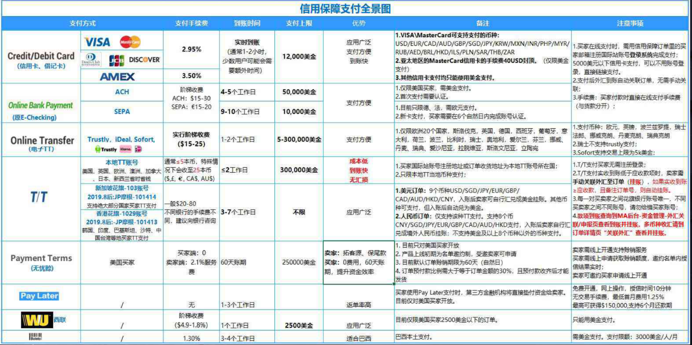

# 目录
- [FOB](#fob)
- [CIF](#cif)
- [CFR，Cost and Freight](#cfrcost-and-freight)   
- [EXW](#exw)   
- [DDP](#ddp)
- [其他协议](#其他协议)
- [总结：](#总结)

---

# FOB
### 离岸价。
### 买方租船订舱，费用也是买方承担
###  货物在指定的装运港越过船舷，卖方即完成交货。
##### `买方`: 负责租船订舱并在船上接货及后续至目的地一切事宜及费用。  &nbsp;&nbsp;&nbsp;&nbsp;&nbsp;&nbsp;货物在指定的装运港越过船舷，必须从这个时候开始承担货物灭失与损坏的一切风险。
##### `卖方`: 必须办理货物出口相关手续,负责把货物运至离岸码头并安排报关。
**`仅适用于海运、内河运输。`**
### 离岸港口船上交货，交易地点明确. “付款条件”呢？

#### FOB 条款下，付款条件是，买家100%预付时:
###### 因为电汇的滞后性，实际操作是货物出厂前就付款了，这跟EXW条件下买方付款时间不一样么，但是买方等货物上船才拿到货比EXW条件下还晚拿到货，所以如果付款条件是买家100%发货前付款的话，其实EXW 更有利于买方。 `报关` : 如果买方不熟悉卖方国家报关事宜的时候，通常也会选择FOB. 但是EXW条件，理论是买方负责报关，通常很多时候也会卖方负责报关，在不会有太多额外成本的基础上（报关费150）以减少买方不便。
#### 买家 30%预付，尾款等货上船在付时：
###### 那么还是上面提到的天平⚖️，左边卖家的货完全转移到了右边买家那，买家右边30%的货款转移到了左边卖家那，这时候天平是向右边买家倾斜，对卖家不利，卖家急需的是收回尾款，但FOB条件下，船是买方小弟，即不付尾款货也是买家的啦。这时候卖家风险存在。
**除非买家预付70%（接近卖家成本）卖家才敢冒险接受FOB条款。**

# CIF
### 卖方租船订舱，费用也是卖方承担。
### 离岸港口船上交货，货权及风险在交接完毕后转移到买方。
#### 成本+保险+运费。
#### 货物的总价格 = 货物价值 + 保险 + 全部运费
#### 这些是要卖家出的。除了特殊约定，一切按照最低价投险。
###### EXW FOB 货权/风险/费用同时转移，但CIF 卖方的货在卖方的离岸港口船上风险由卖方转移到买方，但实际货权却没转移到买方，因为船也是卖方的么，自己的货在自己船上转，这也就是说的CIF 是“典型的象征性交货” . 我给它叫“糊弄上帝交货”. 所以前面说的付款条件，买方30%预付，卖方接受，用CIF“糊弄上帝交货”。

## FOB 与 CIF 的抉择，取决于买方的预付款是30%还是70%。30%选CIF，70%选FOB。

# CFR，Cost and Freight
### 成本+运费。
#### `卖方`负责运输。
#### `买方`购买保险。

# EXW
### 工厂（或其所在地）交货，也叫“原产地合同”
#### `货物交割后，买方负责，费用与风险并存（C组术语例外）`
###### 按照`“一手交钱 一手交货”`的原则，卖方货好就通知买方付款了，所以实际是买方先付款，前面提到天平⚖️，这时候是对卖方有利，买方急需做的就是收货，所以租船订舱派自己的货代（小弟）收货.

###### 除了买方通过电汇付款给卖方，这中间有1-2天的时间差，货款基本是同时交换，所以也是接近“一手交钱 一手交货”的交易方式的. 当然款到，卖方可能也不会发货，所以这就是买方的风险，所以货好买方派第三方验货很有必要，至少一定程度上降低风险. 第二个风险就是买方接货后到目的地运输过程中的风险，可以通过购买保险对抗风险.

**总结：EXW 条件下作为卖方，`一定要等款到发货`。**

# DDP
### 目的地完税交货(风险极大)
### `卖方` : 负责把货从自己工厂运至买方自己仓库完成交货，全程的运输及报关目的国清关事宜及费用。
### 卖方在交付后，买方付款，如果买方不付呢？所以这个条款卖方的收款风险最大，而且运输途中的一切风险费用也要承担，最重要的是买方国家的清关各种关税等如果不熟悉，慎用。

# 其他协议
### 前面FOB CIF 都是海运，除了海运还有适合陆/空/铁的，但都按上面分成三类.

1. 原产地合同： EXW

2. 装运合同：

   * FOB ，CFR， CIF

   * FCR （陆运版FOB）
   *  CPT（陆运版CFR）
   *   CIP（陆运版CIF）

   * FOB小弟 FAS （船边交货），啥时候小弟上呢？比如有个小码头，巨轮靠不了岸，你只能用小轮渡把货运至深海巨轮船边

3. 到货合同
   * DDP DDU

# 总结：

   * 1.国际贸易术语 : **`货权/风险/费用多数同时转移，除了C组的“象征性交货”。`**
     * **`理解术语`**
       * 确认 **`货物交割地点`** 
       * 确认 **`实际的彼此交割人（到底是谁的雇佣）`**

   * 2.**`付款方式(电汇)`** :
     * 确认 **`付款时间`**（发货先后）
     * 分析 **`付款比例`**

   * 3.**`选择何种“术语”，首先是确认“付款方式”，其次才是“国际贸易术语”`** 。 “术语”中的海路空，根据产品价值/重量，客户交付快慢及客观运输地理条件作出选择。 第一风险是 **`收汇（或收货）风险`**，其次才是 **`运输过程风险，运输风险靠保险解决`** 。

   * 4.外贸术语理论中是根据“一手交钱 一手交货”的原则，货交付款，但因为 **`电汇付款的滞后性`** ，作为卖方往往 **`要求买方先付或一定比例`**，这就造成天平⚖️失衡，失衡后的风险，及补救就又回归到贸易术语选择上. 作为自己老客户（买方）在贸易术语选择上，有时候可以接受天平偏向买方的术语以示支持，但一定要考虑自己的承受极限.

#### 补充： 关于成本，除了货物本身成本及运输保险等费用外，也要考虑 “资金成本”. 比如DDP术语下，货发到客户那里才能收款，资金占用时间过长。

# 信用保障支付详解图

# 不常用的协议

# FAS
### 船边交货
### `卖方` : 负责把货物交到港口码头买方指定船只的船边，船舶不能停靠码头需要过驳时，交到驳船上，卖方的风险、责任和费用均以此为界，以后一切风险和费用均由买方承担的一种买卖协议。
#### `卖方` : 
   * 自担交付前产生的风险和费用，取得任何出口许可证或其他官方许可，并在需要办理海关手续时，办理货物出口所需的一切海关手续。
   * 在买方指定的装运港，在买方指定的装货地点，在约定的日期或期限内，按照该港习惯方式将货物交至买方指定的船边。

**`rule`** ：在买方指定的装运港，在买方指定的装货地点，在约定的日期或期限内，按照该港习惯方式将货物交至买方指定的船边。

#### `买方` : 
   * 支付按照 `rule` 交货时与货物有关的一切费用
     * 及由于买方指定的船只未按时到达，或未装载上述货物或较按 `rule`通知的时间提早停止装货
     * 买方未按照 `rule` 给予卖方相应的通知而发生的任何额外费用，但以该项货物已正式划归合同项下，即清楚地划出或以其他方式确定为合同项下之货物为限
     * 在需要办理海关手续时，货物进口应交纳的一切关税、税款和其他费用，及办理海关手续的费用，以及从他国过境的费用。
   * 必须在卖方按照 `rule` 交货时受领货物。
   * 风险转移, 按照下述规定承担货物灭失或损坏的一切风险 :
     * 卖方按 `rule` 时起；
     * 及由于买方未按照 `rule` 通知卖方
     * 指定的船只未按时到达
     * 未接收货物
     * 较按照 `rule` 的时间提早停止装货，则自约定的交货日期或期限届满时起，但以该项货物已划拨到合同项下，即明确保留或以其他方式确定为合同项下之货物为限。 

#### 在实际业务中:
  * 当买方指定的载货船舶 `能够直接靠岸` 时，“船边”指码头上装卸工具所及的范围
  * 如果买方所派的船只 `不能靠岸时` , **`卖方则要负责用驳船把货物运至船边，完成船边交货`** 。

**`在对外贸易中，当卖方不愿承担货物的实际出口责任，或者货物在装船方面有特殊困难时，往往采取船边交货条件，以便使自己免除某些义务。`**

# 注意：
   **按照《2000年国际贸易术语解释通则》的解释，FAS术语**
   
   **`只适用于包括海运在内的水上运输方式，交货地点只能是装运港`**。

   **但是，.按照《1941年美国对外贸易定义》的修订本解释，**  

   **FAS是FreealongSide的缩写，即指交到运输工具的旁边。**  

   **`在与北美国家的交易中使用FAS术语时，应在FAS后面加上"Vessel"字样，以明确表示"船边交货"。`**

   **在 `中国进出口业务中` ，若 `买卖双方约定采用FAS这一贸易术语签订合同，则该合同称为FAS合同` ，只要买卖双方当事人在合同中未排除适用。《2000年国际贸易术语解释通则》，则一旦双方在交货方面发生争议时，法院和仲裁庭可依照上述规则进行判决和裁决。**

# FCA
### 货交承运人或地点
### 用于各种运输方式，包括多式联运。  
### `承运人` ： 指任何人在运输合同中，承诺通过铁路、公路、空运、海运、内河运输或上述运输的联合方式履行运输或由他人履行运输。
### `卖方` : 只要将货物在指定的地点交给买方指定的承运人，并办理了出口清关手续，即完成交货。

### 指定地点 : 交货地点的选择对于在该地点装货和卸货的义务会产生影响。
 * 在卖方产区交货，则卖方应负责装货；  
   
   若卖方在其他地点交货，卖方不负责装货。
 * 若买方指定承运人以外的人领取货物，  
   则当卖方将货物交给此人时，即视为已履行了交货义务。

**`卖方`** ： 卖方必须自担货物交付给承运人接管为止的风险和费用，取得任何出口许可证或其他官方许可，并在需要办理海关手续时，办理货物出口所需要的一切海关手续。

**`买方`** : 负责安排运输，并将承运人名称、交通运输工具、交货的时间和地点给予卖方充分通知。  
从卖方交付货物时起，承担货物灭失或损坏的一切风险。  
按合同规定受领交货凭证或相等的电子信息，并按合同规定支付货款。

# CFR
### 成本加运费
### 适用于海运或内河运输
### 装运港船上交货，卖方需支付将货物运至指定目的地港所需的费用。但货物的风险是在装运港船上交货时转移。

`卖方` ： 
   * 由卖方安排运输。
   * 卖方必须自付交接完成前产生的一切费用，按照通常条件订立运输合同，经由惯常航线，将货物用通常可供运输合同所指货物类型的海轮（或依情况适合内河运输的船只）运输至指定的目的港。
   * 卖方在货物装运港越过船舷为止，必须承担货物灭失或损坏的一切风险

`rule` : 卖方必须在装运港，在约定的日期或期限内，将货物交至船上。

`买方` ： 
   * 由买方办理货运保险
   * 买方支付交接完成后产生的一切费用
   * 买方必须在卖方按照 `rule` 交货时受领货物，并在指定的目的港从承运人收受货物
   * 买方必须承担货物在装运港越过船舷之后灭失或损坏的一切风险

**如卖方不及时发出装船通知，则买方就无法及时办理货运保险，甚至有可能出现漏保货运险的情况。**

